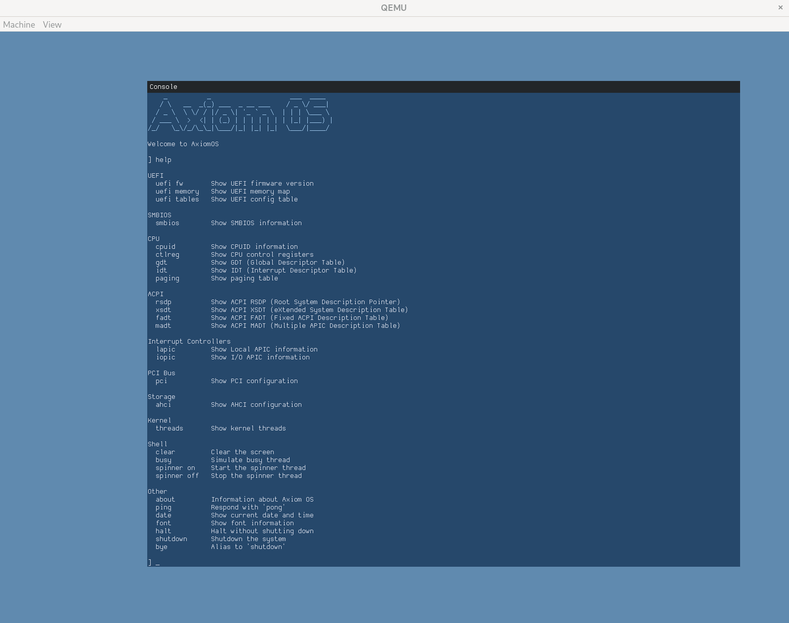

## Axiom OS

This is my attempt at creating a modern 64-bit kernel in Nim.



## Requirements

- Nim 1.9.1
- MinGW-w64
- QEMU
- UEFI BIOS image:
  - Arch: `sudo pacman -S edk2-ovmf`
  - Ubuntu: `sudo apt install ovmf`

## Compile and run

```console
$ nim c --os:any --out:fatimg/EFI/BOOT/BOOTX64.EFI src/boot/boot.nim
$ qemu-system-x86_64 \
    -bios /usr/share/edk2-ovmf/x64/OVMF_CODE.fd \
    -drive format=raw,file.driver=vvfat,file.rw=on,file.dir=fatimg \
    -nic none \
    -machine q35 \
    -monitor stdio
```

Note that the above path for `OVMF_CODE.fd` is the default install path on Arch Linux. For Ubuntu
use the path `/usr/share/OVMF/OVMF_CODE.fd` instead.

## Features

- [ ] UEFI bootloader
  - [x] Simple Text Protocol
  - [x] Graphics Output Protocol (GOP)
  - [ ] Kernel loader
- [ ] Hardware Detection
  - [x] UEFI Memory Map
  - [x] ACPI: I/O APIC
  - [x] ACPI: Local APICs
  - [x] PCI bus enumeratoin
  - [ ] VGA
  - [x] AHCI storage controller
  - [x] SMBIOS information
- [x] Graphics Output
  - [x] Bochs Graphics Adaptor (BGA)
  - [x] Framebuffer
  - [x] Font rendering
- [ ] Segment Descriptors
  - [ ] Global Descriptor Table (GDT)
  - [ ] 64-bit flat memory model
- [ ] Interrupts
  - [ ] Interrupt Descriptor Table (IDT)
  - [ ] Fault and Trap handlers
- [ ] Memory Management
  - [ ] Page frame allocator
  - [ ] Paging (Virtual Memory)
  - [ ] Kernel memory allocator
- [ ] Preemptive Multitasking
  - [x] Kernel threads
  - [ ] User threads
  - [x] Timer IRQ handler
  - [x] Scheduler
- [ ] Multiprocessor Support
  - [ ] SMP
  - [ ] Scheduler
- [ ] Keyboard Input
  - [x] Keyboard IRQ handler
  - [x] Scancode conversion
  - [x] Key event packet
  - [ ] Buffering
- [ ] Storage
  - [ ] SATA ACHI driver
- [ ] File System
  - [ ] TBD
- [ ] System Calls
  - [ ] TBD

### License

MIT
